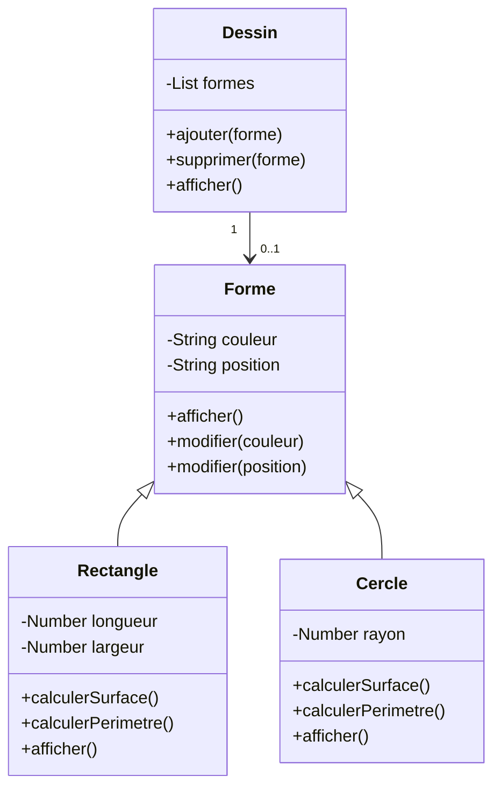

# Forme

> Ce que tu vas travailler :
> - Héritage & Polymorphisme
> - Boucle
> - Abstraction
> - Listes d'objets

Cet exercice te permettra de renforcer ta compréhension de l'héritage et du polymorphisme.
Tu pourras aussi te familiariser avec les concepts de base de la création et de la manipulation de listes d'objets.

> Et oui, cet exercice ressemble à l'exercice [Zoo](../zoo). C'est fait exprès, c'est pour te faire travailler sur l'héritage et la polymorphie sous un autre angle.

## Conseils

- Lis tout l'énoncé avant de commencer afin de bien comprendre ce que tu vas devoir faire.
- Avance étape par étape.
- Test chaque étape avant de passer à la suivante.
- Si tu as cloné le repo, tu peux cocher les étapes que tu as terminées en modifiant le fichier `readme.md` de l'exercice. Cela t'aidera à t'y retrouver.

## Étapes

- [ ] Crée une classe `Forme` avec les propriétés `couleur` et `position`.
    - [ ] Ajoute des méthodes pour `afficher et modifier les propriétés`.
- [ ] Crée une classe `Rectangle` qui hérite de la classe `Forme`.
    - [ ] Ajoute les propriétés spécifiques au rectangle `longueur` et `largeur`.
    - [ ] Ajoute des méthodes pour `calculer la surface`, `le périmètre` et pour `afficher les propriétés` du rectangle.
- [ ] Crée une classe `Cercle` qui hérite également de la classe `Forme`.
    - [ ] Ajoute des propriétés spécifiques au cercle telles que le `rayon`.
    - [ ] Ajoute des méthodes pour `calculer la surface`, `le périmètre` et pour `afficher les informations` du cercle.
- [ ] Rends-toi compte que tu fais deux fois la même chose en pas pareil et factorise en utilisant l'héritage :D
- [ ] Crée une classe `Dessin` qui a un champ de type `List` qui contiendra des `Forme`.
    - [ ] Ajoute des méthodes pour `ajouter`, `supprimer` et `afficher` des `Forme` dans le dessin.
    - [ ] Utilise le polymorphisme pour ajouter des objets de type `Rectangle` et de type `Cercle` dans le dessin.

## Un dessin vaut mieux qu'un long discours

## Pour aller plus loin

Si tu veux, tu peux transformer cet exercice en mini-projet en mettant tout ça en pratique dans un mini logiciel de dessin :

- [ ] Crée une zone de dessin dans une fenêtre.
- [ ] Donne le choix des formes, par exemple dans une liste déroulante.
- [ ] Donne le choix de la couleur, par exemple dans une liste déroulante ou un "color picker".
- [ ] Au clic dans la zone de dessin, dessine la forme choisie à la couleur choisie.
- [ ] Implémente un undo (<kbd>CTRL</kbd> + <kbd>Z</kbd>) et un redo (<kbd>CTRL</kbd> + <kbd>Y</kbd>).
- [ ] Permets de choisir la taille de ta forme.
- [ ] Rajoute des formes : ovale, carré, losange, etc.
- [ ] Permets d'avoir une couleur de contour différente de celle de remplissage.
- [ ] Permets de ne pas avoir de couleur de remplissage (ça dessine juste le contour).
- [ ] Ajoute le choix de l'épaisseur du contour.
- [ ] Ajoute tes propres idées et fais-en nous part !
