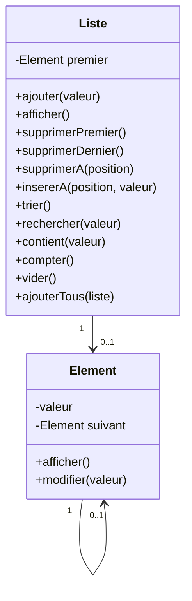

# Liste Chainée

> Ce que tu vas travailler :
> - Structure de données
> - Boucle

Cet exercice te permettra de renforcer ta compréhension des [listes chaînées](https://fr.wikipedia.org/wiki/Liste_cha%C3%AEn%C3%A9e) et des structures de données. 

Il te permettra de créer une structure de données simple et de manipuler des objets.

Tu vas encapsuler des valeurs dans un objet et les lier entre eux pour former une liste.. chaînée !

⚠ _N'utilise pas une collection, ou un tableau, toute faite de ton langage, c'est toi qui vas l'implémenter !_

## Conseils

- Lis tout l'énoncé avant de commencer afin de bien comprendre ce que tu vas devoir faire.
- Avance étape par étape.
- Test chaque étape avant de passer à la suivante.
- Si tu as cloné le repo, tu peux cocher les étapes que tu as terminées en modifiant le fichier `readme.md` de l'exercice. Cela t'aidera à t'y retrouver.

## Étapes

- [ ] Crée une classe `Element` avec une propriété `valeur` du type simple que tu veux (number, string, mais pas array ou object) et une propriété `suivant` de type `Element`.
- [ ] Ajoute des méthodes pour `afficher` et `modifier` la valeur.
- [ ] Ajoute une méthode pour `afficher` l'élément suivant.
- [ ] Crée une classe `Liste` avec une propriété `premier` initialisée à `null`.
- [ ] Ajoute une méthode pour `ajouter` un élément à la liste.
- [ ] Ajoute une méthode pour `afficher` la liste.
- [ ] Ajoute une méthode pour `supprimer le premier élément` de la liste.
- [ ] Ajoute une méthode pour `supprimer le dernier élément` de la liste.
- [ ] Ajoute une méthode pour `supprimer un élément à une position donnée`.
- [ ] Ajoute une méthode pour `insérer` un élément à une position donnée dans la liste.
- [ ] Ajoute une méthode pour `trier` la liste.
- [ ] Ajoute une méthode pour `rechercher` un élément dans la liste afin d'avoir sa position.
  - Mon conseil : renvoie un nombre négatif si tu ne le trouves pas dans ta liste
- [ ] Ajoute une méthode pour savoir si ta liste `contient` un élément passé en paramètre.
- [ ] Ajoute une méthode pour `compter` le nombre d'éléments dans la liste.
- [ ] Ajoute une méthode pour `vider` la liste.
- [ ] Ajoute une méthode pour `ajouter tous les éléments`  d'une autre `Liste` à une liste.
 
## Un dessin vaut mieux qu'un long discours

## Pour aller plus loin

- [ ] Ajoute une méthode pour `afficher` la liste à l'envers.
  - Mon indice : tu as déjà ajouté une propriété `suivant`.
- [ ] Ajoute une méthode pour `inverser` la liste.
- [ ] Tu peux ajouter des tests pour chaque méthode de ta classe `Liste` afin de vérifier que tout fonctionne correctement.
- [ ] Si ton langage te le permet, tu peux typer ta liste pour qu'elle ne contienne que des éléments d'un certain type.
