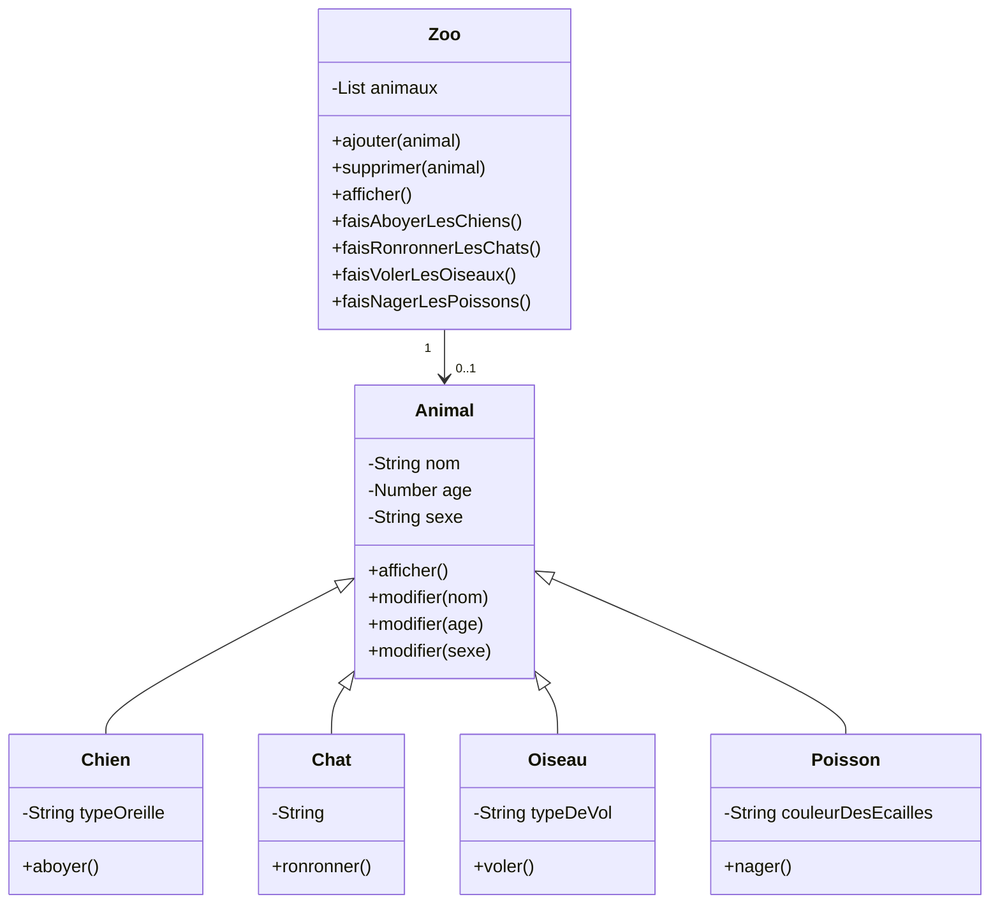

# Zoo

> Ce que tu vas travailler :
> - Héritage & Polymorphisme
> - Boucle
> - Surcharge de méthodes
> - Listes d'objets

Cet exercice te permettra de renforcer ta compréhension de l'héritage et du polymorphisme.
Tu pourras aussi te familiariser avec les concepts de base de la création et de la manipulation de listes d'objets ainsi que la surcharge de méthodes.

> Et oui, cet exercice ressemble à l'exercice [Formes](../formes). C'est fait exprès, c'est pour te faire travailler sur l'héritage et la polymorphie sous un autre angle.

## Conseils

- Lis tout l'énoncé avant de commencer afin de bien comprendre ce que tu vas devoir faire.
- Avance étape par étape.
- Test chaque étape avant de passer à la suivante.
- Si tu as cloné le repo, tu peux cocher les étapes que tu as terminées en modifiant le fichier `readme.md` de l'exercice. Cela t'aidera à t'y retrouver.

## Étapes

- [ ] Crée une classe abstraite `Animal` avec des propriétés telles que le `nom`, l'`âge` et le `sexe`.
    - [ ] Ajoute des méthodes pour `afficher les informations` de l'animal et pour `modifier ses propriétés`.
    - [ ] Ajoute également une méthode abstraite pour les comportements spécifiques de chaque animal, tels que la méthode `manger()` qui devra renvoyer ce que l'animal mange.
- [ ] Crée des classes `Chien`, `Chat`, `Oiseau` et `Poisson` qui héritent de la classe `Animal`.
    - [ ] Implémente la méthode abstraite `manger()` pour chaque animal.
    - [ ] Ajoute des propriétés spécifiques à chaque animal, telles que le `type d'oreille pour le chien`, la `race pour le chat`, le `type de vol pour l'oiseau` et la `couleur des écailles pour le poisson`.
    - [ ] Ajoute la méthode spécifique de chaque animal :
        - [ ] la méthode `aboyer()` pour le chien,
        - [ ] la méthode `ronronner()` pour le chat,
        - [ ] la méthode `voler()` pour l'oiseau.
        - [ ] la méthode `nager()` pour le poisson.
    - [ ] Surcharge la méthode `afficher` pour chaque animal pour qu'elle affiche les informations spécifiques à chaque animal.
- [ ] Crée une classe `Zoo` avec une propriété de `liste d'animaux`.
    - [ ] Ajoute des méthodes pour `ajouter`, `supprimer` et `afficher des animaux` dans le zoo.
    - [ ] Utilise le polymorphisme pour ajouter des objets de type `Chien`, `Chat`, `Oiseau` et `Poisson` dans le zoo.
- [ ] Ajoute une méthode dans la classe `Zoo` qui utilise la méthode spécifique à chaque animal pour afficher un comportement particulier. Par exemple, la méthode `faisAboyerLesChiens()` qui appelle la méthode `aboyer()` pour chaque objet `Chien` dans le zoo.
  - [ ] Fais-le pour tous les animaux.

## Un dessin vaut mieux qu'un long discours
    

## Pour aller plus loin

- [ ] Ajoute un `Type d'animal` à tes animaux : `Terrestre`, `Aérien`, `Aquatique`.
- [ ] Dans la class `Zoo`, la méthode `afficher des animaux` prend désormais un argument de `Type d'animal`, qui peut être null/vide. S'il est vide, la méthode retourne tous les animaux, sinon seulement les animaux du type passé en paramètres.
- [ ] Un animal peu désormais avoir plusieurs types : 
  - [ ] Ajoute la classe `Grenouille` qui est à la fois `Terrestre` et `Aquatique`. 
  - [ ] Modifie en conséquence la méthode `afficher des animaux` pour qu'elle affiche les grenouilles quand on lui passe en paramètres `Terrestre` ou `Aquatique`.
  - [ ] Modifie la méthode `afficher des animaux` pour qu'elle puisse prendre de 0 à N type(s), qui doivent tous être pris en compte lors de l'affiche. Par exemple : Affiche les grenouilles quand on lui passe en paramètres `Terrestre` ou `Aquatique` et affiche les poisons et les grenouilles quand on lui passe `Aquatique`.
- [ ] Supprime les méthodes spécifiques comme `faisAboyerLesChiens()` par une méthode générique qui prend en paramètre la classe d'un `Animal` et appelle la méthode spécifique de l'animal choisi.
- [ ] Ajoute la gestion d'`Enclos` dans ton `Zoo`. Un `enclos` a un nom unique qui lui permet d'être retrouvé. 
  - [ ] Un `Enclos` a un ou plusieurs types et n'accepte que des Animaux de ces types. Par exemple un bassin n'acceptera que les animaux de type `Aquatique` et `Terrestre`. Un animal pourra aller dans un enclos s'il a au moins un type.
- [ ] Crée des `Enclos exclusif` et des `Enclos inclusif` qui héritent tous les deux d'une class `Enclos` : 
  - [ ] Les `Enclos inclusif` peuvent accepter des animaux de n'importe quel types spécifiés, c'est l'`Enclos` initial.
  - [ ] Les `Enclos exclusif` ne peuvent accepter que des animaux des types spécifiés : par exemple, un aquarium de type `Aquatique` ne pourra contenir que des poissons et pas de Grenouille.
